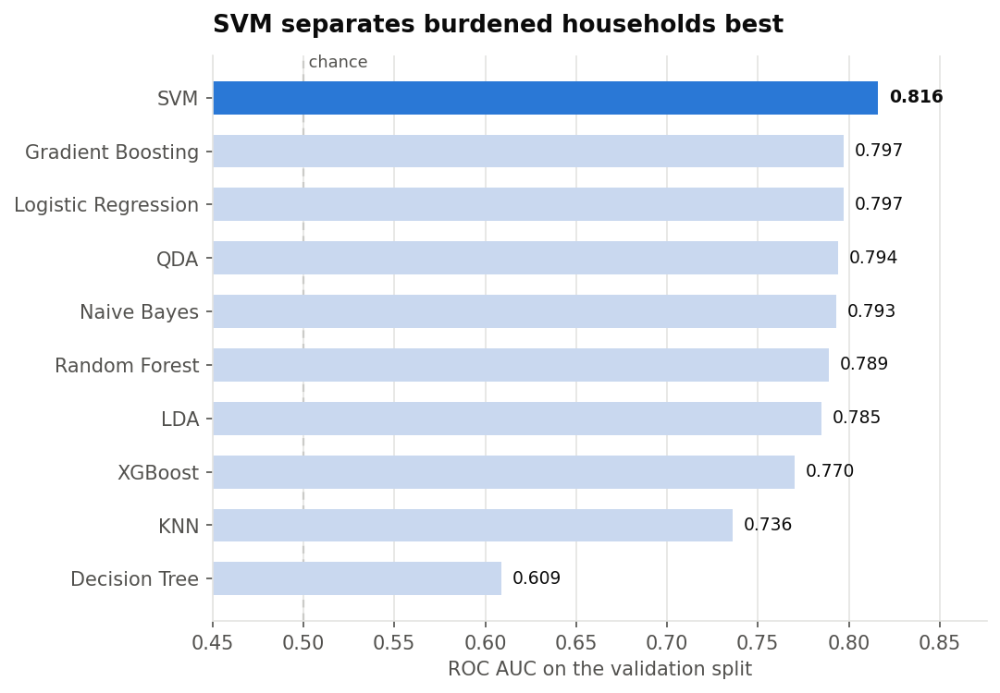

# household-burden-classifier

**Predicting household cost-of-living burden from survey data.**

Binary classification on demographic, housing and behavioural survey responses:
given a household's characteristics, estimate the probability that it reports
being financially burdened.



## What was done

Ten algorithms were compared on a held-out validation split — logistic
regression, LDA, QDA, naive Bayes, KNN, SVM, decision tree, random forest,
gradient boosting and XGBoost — each behind the preprocessing it needs
(median imputation, one-hot encoding, and scaling only where the algorithm
requires it).

Three things were then checked that a leaderboard alone does not answer:

**Does the model separate the two classes, or just score well on average?**
`04_class_separation.png` plots the predicted probability of every validation
household split by its true class. Where the two distributions pull apart the
model is confident and right; where they overlap it cannot tell the cases
apart. That overlap is the real ceiling on this problem.

**Is 0.5 the right decision threshold?** It is a default, not a law. It assumes
a false positive costs exactly as much as a false negative, which is not true
when the output would be used to target support. `05_threshold_choice.png`
sweeps precision, recall and F1 across every threshold and marks where F1
peaks.

**Do the probabilities mean what they say?** `06_calibration.png` is a
reliability diagram: it compares predicted probabilities against observed
frequencies. The model as trained understates risk — households given 0.40 are
burdened about 47% of the time — which is a known behaviour of tree ensembles,
and is why the optimal threshold sat below 0.5. Isotonic recalibration corrects
most of it: **Brier 0.185 → 0.176**, against 0.250 for always predicting the
base rate.

The shipped model is whichever version scores better on Brier, with its
threshold recomputed on the rescaled probabilities. `outputs/tables/12_final_model.csv`
records the final numbers.

## Layout

```
modelling.ipynb          the analysis, runnable top to bottom
burden.py                my474_predict(X, fitted_object) — inference entry point
burden.pickle            the fitted model that is shipped
outputs/figures/         model ranking, class separation, threshold, calibration
outputs/tables/          model comparison, threshold sweep, final metrics
data/                    training data and a worked example
```

## Using the model

```python
import pickle, pandas as pd
from burden import my474_predict

with open("burden.pickle", "rb") as f:
    model = pickle.load(f)

X = pd.read_csv("data/summative_example.csv").drop(columns=["y"])
probs = my474_predict(X, model)     # P(burdened) for each row
```

`my474_predict` expects predictor columns only and returns one probability per
row. Apply the threshold from `outputs/tables/12_final_model.csv` rather than
0.5 — that is the point of the analysis above.

> **On the pickle:** it is committed because the assessment format required a
> fitted object a grader could load directly. Unpickling executes code, so only
> load pickles you trust. `modelling.ipynb` rebuilds everything from scratch.

## Reproducing

```bash
pip install -r requirements.txt
jupyter execute modelling.ipynb
```

Paths are relative to the repository root, and every cell imports what it uses,
so the notebook runs from a clean kernel without being executed out of order.

## Context

Summative assessment for MY474 Machine Learning, LSE, 2026.
