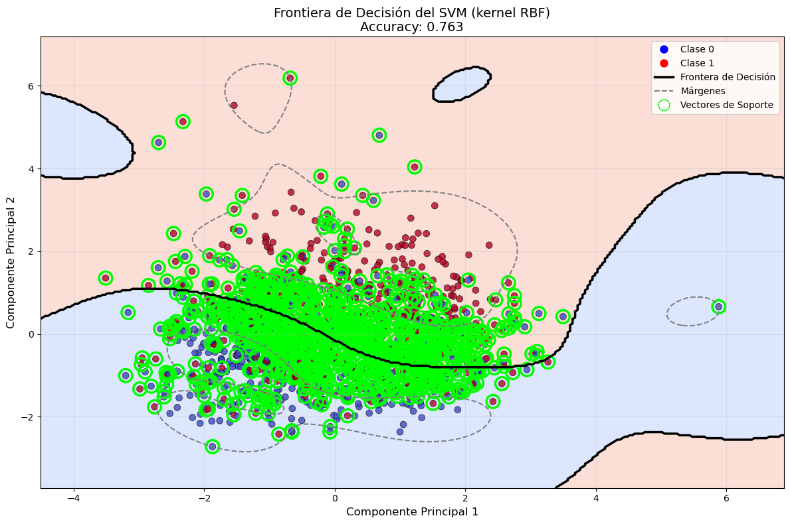

# household-burden-classifier

**Predicting household cost-of-living burden from survey data.**

Binary classification on demographic, housing and behavioural survey
responses: given a household's characteristics, estimate the probability
that it reports being financially burdened.



## Method

A scikit-learn `Pipeline` combining feature engineering and target encoding
with a linear classifier, chosen after comparing logistic regression, random
forest, gradient boosting, SVC and XGBoost. The fitted pipeline is serialised
so it can be scored on unseen data without retraining.

## Layout

```
modelling.ipynb          the analysis source
burden.py                my474_predict(X, fitted_object) — inference entry point
burden.pickle            the fitted pipeline
outputs/figures/         plots, as PNG
outputs/tables/          data summaries, as CSV and text
data/                    training data and a worked example
```

Source at the root, results in `outputs/`, inputs in `data/` — the same
layout as the other repositories.

## Using the fitted model

```python
import pickle, pandas as pd
from burden import my474_predict

with open("burden.pickle", "rb") as f:
    model = pickle.load(f)

X = pd.read_csv("data/summative_example.csv").drop(columns=["y"])
probs = my474_predict(X, model)   # array of P(burdened) in [0, 1]
```

`my474_predict` returns one probability per row and expects predictor
columns only — no target column.

> **On the pickle:** it is committed because the assessment format required a
> fitted object a grader could load directly. Unpickling executes code, so
> only load pickles you trust. `modelling.ipynb` rebuilds the model from
> scratch if you would rather not.

## Reproducing

```bash
pip install -r requirements.txt
jupyter execute modelling.ipynb
```

## Known gap

`outputs/tables/` holds the exploratory summaries — variable types, missing
values, target balance, category counts. It does **not** yet hold the model
comparison, because those cells were run without their output saved in the
notebook. Re-running `modelling.ipynb` and exporting the scores table would
put the result that matters most next to the ones that are already here.

## Context

Summative assessment for MY474 Machine Learning, LSE, 2026.
